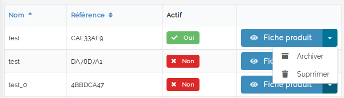

=======
Actions
=======

Il existe 3 types d'actions avec le bundle SyliusGridBundle :

- main
- item
- bulk

Les actions de type main n'ont pas été implémentées.

----
Item
----

Une action d'élément est présente pour chaque ligne de la table utilisée pour l'affichage.

Elle est définie de cette manière :

.. code-block:: yaml

    sylius_grid:
        grids:
            my_grid:
                actions:
                    item:
                        show:
                            type: default
                            icon: eye
                            label: Voir
                            options:
                                link:
                                    route: myapp_mybundle_myentity_show
                                    parameters:
                                        myEntityId: resource.id

Le bundle propose un type d'action par défaut, nommé ``default``, qui réalise un groupage des actions dans un menu déroulant.

Le groupage consiste à afficher la premère action en tant que bouton dédié et les autres dans la liste déroulante qui est accolée à la première action

Il est bien entendu possible de définir des actions personnalisées. Pour cela, consulter la documentation du bundle SyliusGridBundle_

.. _SyliusGridBundle: http://docs.sylius.com/en/1.1/components_and_bundles/bundles/SyliusGridBundle/custom_action.html

----
Bulk
----

Des actions de masse peuvent être définies pour chaque grid.

.. code-block:: yaml

    sylius_grid:
        grids:
            my_grid:
                actions:
                    bulk:
                        export:
                            type: export
                            icon: external alternate
                            label: Exporter
                            options:
                                link:
                                    route: myapp_mybundle_myentity_export
                                    parameters:
                                        format: csv

Un bouton en bas de la table sera alors affiché, ainsi que des cases à cocher de selection pour chaque ligne de la table.

L'action de contrôleur devra gérer les éléments cochés de cette manière :

.. code-block:: php

    public function exportAction(Request $request)
    {
        $ids = array_filter(explode(',', $request->get('ids', null)));

        if (count($ids) > 0) {
            // Do a partial export
        } else {
            // Do a full export
        }

        return new Response('Export done');
    }
