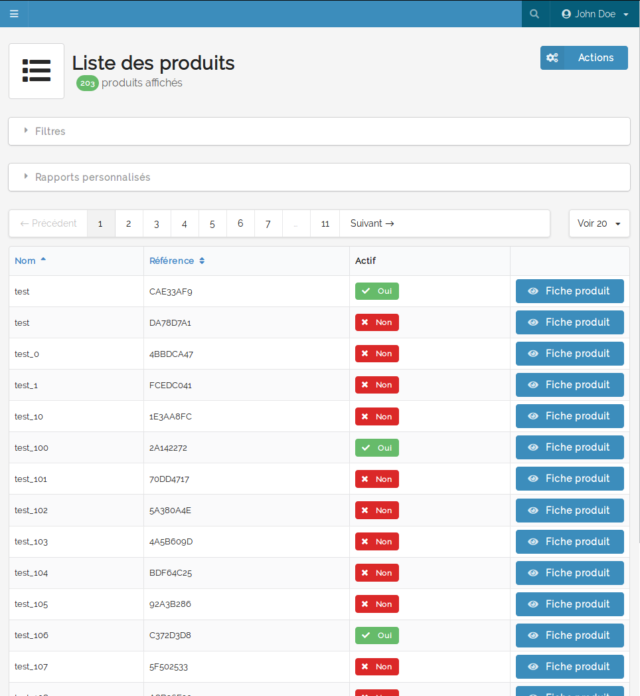

=============
Configuration
=============

Le bundle ne rajoute pas plus de configuration que celle présente dans le bundle ``SyliusGridBundle``.

Pour aller plus en détails, se référer à la documentation du bundle SyliusGridBundle_.

.. _SyliusGridBundle: http://docs.sylius.com/en/1.1/components_and_bundles/bundles/SyliusGridBundle/index.html

Vous pouvez configurer les templates qui seront utilisés par les grids (filtres, actions et actions de masse).

Une définition de base est embarquée dans le fichier ``@BlastGrid/Resources/config/config.yml``.

Mais vous pouvez redéfinir ces templates depuis n'importe quel fichier de configuration, voir même depuis une définition de grid.

.. code-block:: yaml

    sylius_grid:
        templates:
            filter:
                string: '@MyAppMy/Grid/Filter/string.html.twig'
                boolean: '@MyAppMy/Grid/Filter/boolean.html.twig'
            action:
                default: '@MyAppMy/Grid/Action/default.html.twig'
            bulk_action:
                my_bulk_action: '@MyAppMy/Grid/BulkAction/my_bulk_action.html.twig'

---------------------
Exemple d'utilisation
---------------------

Configuration de la grid
========================

.. code-block:: yaml

    sylius_grid:
        grids:

            my_grid:

                # Association avec l'ORM
                driver:
                    name: doctrine/orm
                    options:
                        class: 'MyAppBundle:MyEntity'

                # Définition des valeurs de résultats par page
                limits: [20,50,200]

                # Tri par défaut
                sorting:
                    name: asc

                # Définition des filtres
                filters:
                    name:
                        type: string
                        label: Nom
                        form_options:
                            type: contains
                    code:
                        type: string
                        label: Code
                    enabled:
                        label: Actif
                        type: boolean

                # Définition des champs de la table
                fields:
                    name:
                        type: string
                        label: Nom
                        sortable: ~
                    code:
                        type: string
                        label: Code
                        sortable: ~
                    enabled:
                        type: twig
                        label: Actif
                        options:
                            template: '@MyApp/MyBundle/grid_field_enabled.html.twig'

                # Définition des actions (item et bulk)
                actions:
                    item:
                        show:
                            type: default
                            icon: eye
                            label: Voir
                            options:
                                link:
                                    route: myapp_mybundle_myentity_show
                                    parameters:
                                        myEntityId: resource.id

Controller
==========

Le contrôleur qui gérera la vue a besoin du service ``blast_grid.grid_handler`` pour construire la grid.

.. code-block:: php

    use Blast\Bundle\GridBundle\Handler\GridHandlerInterface;

    /**
     * @var GridHandlerInterface
     */
    protected $gridHandler;

    /**
     * list route.
     *
     * @param Request $request
     *
     * @return Response
     */
    public function listAction(Request $request): Response
    {
        $gridView = $this->gridHandler->buildGrid('sil_user');

        return $this->render('@MyApp/MyBundle/myEntity.html.twig', [
            'grid' => $gridView,
        ]);
    }

Vue
===

La vue doit simplement appeler la fonction twig ``sylius_grid_render``.

.. code-block:: twig

    {{ sylius_grid_render(grid) }}

Rendu
=====

Voila le rendu d'une grid sur une liste de produit.

