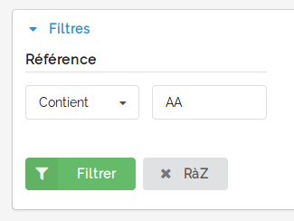

=======
Filtres
=======

Les filtres de base proposés par le bundle ``SyliusGridBundle`` sont les suivants :

 - string
 - boolean
 - date
 - entity
 - money
 - exists

---------------
Type embeddable
---------------

Le bundle propose un type, nommé ``embeddable`` dédié aux Embeddable_ de doctrine.

Ce filtrer permet de définir le chemin d'accès à la propriété de l'objet embarqué.

.. _Embeddable: https://www.doctrine-project.org/projects/doctrine-orm/en/2.6/tutorials/embeddables.html

---------------------
Exemple d'utilisation
---------------------

La classe ``Product`` possède un code qui est définit à l'aide de la classe ``ProductCode``:

.. code-block:: php

    class ProductCode
    {
        /**
         * Product unique identifier code.
         *
         * @var string
         */
        protected $value;
    }

    class Product
    {
        /**
         * Product code
         *
         * @var ProductCode
         */
        protected $code;
    }

.. code-block:: yaml

    sylius_grid:
        grids:
            sil_product:
                filters:
                    code:
                        type: embeddable
                        label: Code
                        options:
                            embbedable_property: value

Grâce à ce filtre, la grid peut formater correctement une requête de filtrage à travers le ``QueryBuilder`` de doctrine avec la notation de ce genre ``o.code.value``.

.. code-block:: sql

    SELECT FROM SilProductBundle:Product p WHERE p.code.value LIKE :criteria

Requête DQL qui génère ce genre de requête SQL:

.. code-block:: sql

    SELECT
        s0_.id AS id_0,
        s0_.code_value AS code_value_1
    FROM
        sil_product s0_
    WHERE
        s0_.code_value ILIKE '%AA%'
    ORDER BY
        s0_.code_value ASC
    LIMIT
        20 OFFSET 0

-----------------
Type personnalisé
-----------------

Il est bien évidement possible de définir des types de filtres personnalisés. Pour cela, se référer à la documentation du bundle SyliusGridBundle_.

.. _SyliusGridBundle: http://docs.sylius.com/en/1.1/components_and_bundles/bundles/SyliusGridBundle/custom_filter.html
