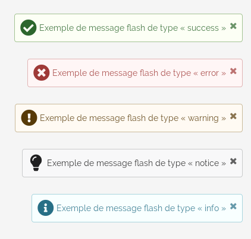

==============
Flash messages
==============

Le bundle propose une gestion basique des messages flash (alertes affichées sous forme de popup dans le coin inférieur droit).

----------------
Type de messages
----------------

Il existe 5 types de messages, qui sont affiché avec des couleurs et icônes différentes (voir le rendu précédent).

- info
- notice
- warning
- error
- success

--------
Côté php
--------

Dans un contrôleur
==================

.. code-block:: php

    <?php

    // [...]

    $this->addFlash('success','Exemple de message flash de type « success »');

    // [...]

Ailleurs
========

.. code-block:: yaml

    service:
        exemple:
            class: App/Example
            arguments:
                - '@session.flash_bag'

.. code-block:: php

    <?php

    use Symfony\Component\HttpFoundation\Session\Flash\FlashBagInterface

    /**
     * @var FlashBagInterface
     */
    private $flashBag;

    public function __construct(FlashBagInterface $flashBag)
    {
        $this->flashBag = $flashBag;
    }

    // [...]

    $this->flashBag->add('success','Exemple de message flash de type « success »');

    // [...]

---------------
Côté Javascript
---------------

Sans élément
============

.. code-block:: javascript

    $.fn.showFlashMessage('success', 'Exemple de message flash de type « success »');

Depuis un élément
=================

.. code-block:: javascript

    $(document).showFlashMessage('success', 'Exemple de message flash de type « success »');

Afficher tous les types de messages
===================================

.. code-block:: javascript

    $(['info', 'notice', 'warning', 'error', 'success']).each(function() {
        $.fn.showFlashMessage(this,'Exemple de message flash de type « '+this+' »');
    });
