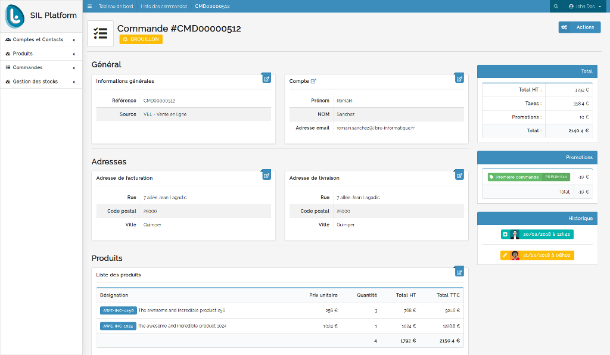
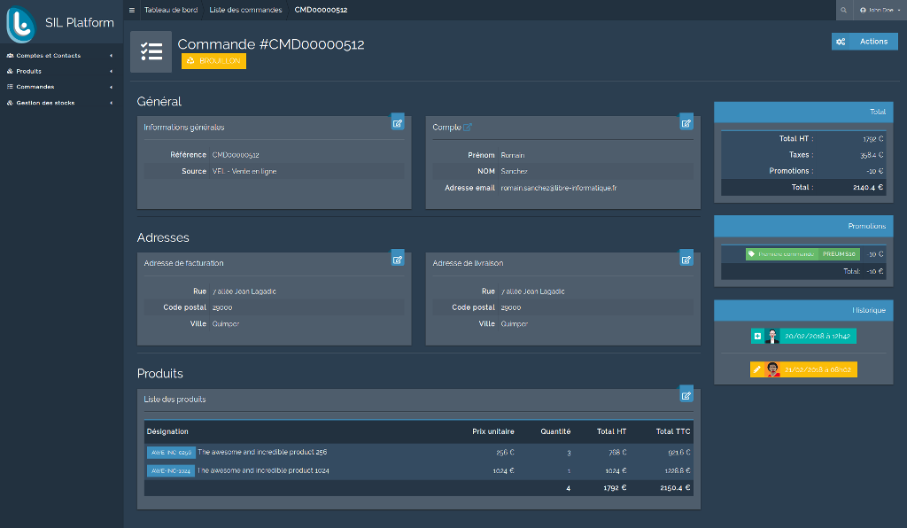

Thèmes
======

2 thèmes Semantic UI sont proposés dans ce bundle :

--------
Librinfo
--------

C'est le thème `Semantic UI <https://semantic-ui.com/>`_ de base avec quelques retouches visuelles faites :

- Police de caractère mise à ``Raleway``.
- Couleurs principales aux couleur de Libre-informatique

---------
Superhero
---------

Hérité du thème `Superhero <https://github.com/semantic-ui-forest/semantic-ui-forest>`_, ce thème légèrement retouché propose des couleurs et des rendus de composants sombres.

------------
Modification
------------

Un dépôt dédié aux modifications du thème à été créé spécialement pour cela : https://github.com/blast-project/SemanticLI
