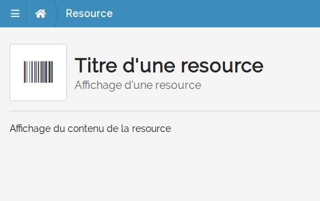
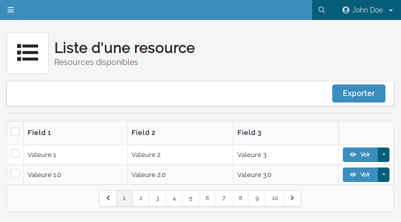

==========
Vues types
==========

Plusieurs vues type sont disponibles :

----
Show
----

Cette vue est dédiée à l'affichage d'une resource et éventuellement son édition au travers des widgets ``card``.

Exemple
=======

.. code-block:: twig

    

    
        Titre d'une resource
    

    
        barcode
    

    
        Affichage d'une resource
    

    
        Affichage du contenu de la resource
    

Rendu
=====

----
List
----

Cette vue est dédiée au listing d'un type de resource.

Exemple
=======

.. code-block:: twig

    

    
        Liste d'une resource
    

    
        list
    

    
        Resources disponibles
    

    
        {{ parent() }}
    

.. code-block:: php

    <?php

    // [...]

    list = [
        'filters'  => [],
        'elements' => [
            [
                'field_1' => 'Valeure 1',
                'field_2' => 'Valeure 2',
                'field_3' => 'Valeure 3',
            ], [
                'field_1' => 'Valeure 1.0',
                'field_2' => 'Valeure 2.0',
                'field_3' => 'Valeure 3.0',
            ],
        ],
        'headers'  => [
            [
                'name'  => 'field_1',
                'label' => 'Field 1',
            ], [
                'name'  => 'field_2',
                'label' => 'Field 2',
            ], [
                'name'  => 'field_3',
                'label' => 'Field 3',
            ],
        ],
        'actions'  => [
            [
                'label' => 'Voir',
                'icon'  => 'eye',
            ], [
                'label' => 'Supprimer',
                'icon'  => 'trash',
            ],
        ],
    ];

    // [...]

    return $this->render(..., ['list' => $list]);

Rendu
=====

