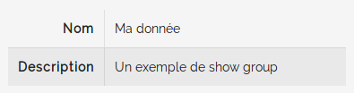

=======
Widgets
=======

Le bundle propose plusieurs widgets permettant l'affichage de composant graphique communs.

Liste des widgets présents :

- `Panel`_
- `Card`_
- `Field`_
- `FieldGroup`_
- `ShowGroup`_
- `FormGroup`_
- `Table`_
- `StepHeader`_
- `StepNav`_
- `Modal`_

-----
Panel
-----

Définition
==========

.. code-block:: twig

    {{ blast_widget_panel(title, content) }}
    {{ blast_widget_panel(title, content, class) }}
    {{ blast_widget_panel(title, content, class, template) }}

Un panneau ajoute un **ui segment** et un **header** au contenu passé en paramètre.

+-----------+----------------------------------------------------------+--------+
| Paramètre | Description                                              | Oblig. |
+===========+==========================================================+========+
| title     | Titre qui sera affiché en heading du panneau             |        |
+-----------+----------------------------------------------------------+--------+
| content   | Contenu rendu (html) ou à rendre dans le corp du panneau | x      |
+-----------+----------------------------------------------------------+--------+
| class     | Classes css à appliquer au widget                        |        |
+-----------+----------------------------------------------------------+--------+
| template  | Template alternatif pour le rendu                        |        |
+-----------+----------------------------------------------------------+--------+

Exemple
=======

.. code-block:: twig

    {{ blast_widget_panel('Titre', 'Lorem ipsum...', 'four wide column') }}

    {{ blast_widget_panel(null, 'Panneau sans titre...', 'four wide column') }}

Rendu
=====

----
Card
----

Définition
==========

.. code-block:: twig

    {{ blast_widget_card(title, entity, fields) }}
    {{ blast_widget_card(title, entity, fields, form) }}
    {{ blast_widget_card(title, entity, fields, form, class) }}
    {{ blast_widget_card(title, entity, fields, form, class, template) }}
    {{ blast_widget_card(title, entity, fields, form, class, template, showTemplate) }}
    {{ blast_widget_card(title, entity, fields, form, class, template, showTemplate, formTemplate) }}

Une **Card** est un panneau affichant des données issues d'une entité / d'un objet / d'un tableau et affiche également un formulaire si besoin.

+--------------+----------------------------------------------------------+--------+
| Paramètre    | Description                                              | Oblig. |
+==============+==========================================================+========+
| title        | Titre qui sera affiché en header de la card              | x      |
+--------------+----------------------------------------------------------+--------+
| entity       | Données source (entité ou tableau)                       | x      |
+--------------+----------------------------------------------------------+--------+
| form         | Formulaire d'édition (instance de FormView)              |        |
+--------------+----------------------------------------------------------+--------+
| class        | Classes css du panneau de la card                        |        |
+--------------+----------------------------------------------------------+--------+
| template     | Template alternatif pour le rendu de la card             |        |
+--------------+----------------------------------------------------------+--------+
| showTemplate | Template alternatif pour la partie affichage des données |        |
+--------------+----------------------------------------------------------+--------+
| formTemplate | Template alternatif pour la partie édition               |        |
+--------------+----------------------------------------------------------+--------+

Exemple
=======

.. code-block:: twig

    {{ blast_widget_card('Titre de la card', entity, [
        {'name':'name','label':'Nom'},
        {'name':'description','label':'Description'}
    ], form )}}

Elle peut être utilisée uniquement pour de l'affichage en ne passant pas de formulaire

.. code-block:: twig

    {{ blast_widget_card('Exemple de card non-éditable', entity,[
        {'name':'name','label':'Nom'},
        {'name':'description','label':'Description'}
    ] )}}

Rendu
=====

-----
Field
-----

Définition
==========

.. code-block:: twig

    {{ blast_widget_field(type, fieldOptions) }}
    {{ blast_widget_field(type, fieldOptions, template) }}

Permet d'afficher un champ ou un bouton.

+--------------+--------------------------------------------+--------+
| Paramètre    | Description                                | Oblig. |
+==============+============================================+========+
| type         | Le type de champ à afficher                | x      |
+--------------+--------------------------------------------+--------+
| fieldOptions | Le tableau d'option définissant le champ   | x      |
+--------------+--------------------------------------------+--------+
| template     | Template alternatif pour le rendu du champ |        |
+--------------+--------------------------------------------+--------+

Liste des configuration pour chaque type de champ.

+------------+------------------------+------------------------+
| Type       | Configuration minimale | Configuration complète |
+============+========================+========================+
| button     | - label: string        | - label: string        |
|            |                        | - class: string        |
|            |                        | - readonly: bool       |
|            |                        | - icon: string         |
|            |                        | - attr: array          |
+------------+------------------------+------------------------+
| checkbox   | - name: string         | - name: string         |
|            | - label: string        | - label: string        |
|            | - value: bool          | - value: bool          |
|            |                        | - class: string        |
|            |                        | - readonly: bool       |
|            |                        | - inline: bool         |
|            |                        | - attr: array          |
+------------+------------------------+------------------------+
| checkboxes | - name: string         | - name: string         |
|            | - label: string        | - label: string        |
|            | - values: array        | - values: array        |
|            |                        | - class: string        |
|            |                        | - readonly: bool       |
|            |                        | - inline: bool         |
|            |                        | - attr: array          |
+------------+------------------------+------------------------+
| datetime   | - name: string         | - name: string         |
|            | - value: string        | - value: string        |
|            |                        | - label: string        |
|            |                        | - class: string        |
|            |                        | - readonly: bool       |
|            |                        | - inline: bool         |
|            |                        | - attr: array          |
+------------+------------------------+------------------------+
| hidden     | - name: string         | - name: string         |
|            | - value: string        | - value: string        |
|            |                        | - class: string        |
|            |                        | - attr: array          |
+------------+------------------------+------------------------+
| link       | - label: string        | - label: string        |
|            |                        | - src: string          |
|            |                        | - class: string        |
|            |                        | - icon: string         |
|            |                        | - attr: array          |
+------------+------------------------+------------------------+
| number     | - name: string         | - name: string         |
|            | - value: int           | - value: int           |
|            |                        | - label: string        |
|            |                        | - class: string        |
|            |                        | - readonly: bool       |
|            |                        | - attr: array          |
+------------+------------------------+------------------------+
| select     | - name: string         | - name: string         |
|            | - value: string        | - value: string        |
|            | - values: array        | - values: array        |
|            |                        | - class: string        |
|            |                        | - readonly: bool       |
|            |                        | - attr: array          |
+------------+------------------------+------------------------+
| submit     | - name: string         | - name: string         |
|            |                        | - label: string        |
|            |                        | - class: string        |
|            |                        | - readonly: bool       |
|            |                        | - icon: string         |
|            |                        | - attr: array          |
+------------+------------------------+------------------------+
| text       | - name: string         | - name: string         |
|            | - value: string        | - value: string        |
|            |                        | - label: string        |
|            |                        | - class: string        |
|            |                        | - inline: bool         |
|            |                        | - readonly: bool       |
|            |                        | - attr: array          |
+------------+------------------------+------------------------+
| textarea   | - name: string         | - name: string         |
|            | - value: int           | - value: int           |
|            |                        | - class: string        |
|            |                        | - inline: bool         |
|            |                        | - readonly: bool       |
|            |                        | - attr: array          |
+------------+------------------------+------------------------+

Exemple
=======

Le bouton « Annuler » du formulaire de la `Card`_ est inclue de cette manière :

.. code-block:: twig

    {{ blast_widget_field('link', {
        label: 'Annuler',
        class: 'button left floated close',
        icon: 'undo'
    }) }}

Exemple d'affichage d'un champ de type ``select`` :

.. code-block:: twig

    {{ blast_widget_field('select', {
        label: 'Une liste de choix',
        name: 'une_liste',
        value: 'Choix #3',
        values: [
            'Choix #1',
            'Choix #2',
            'Choix #3',
            'Choix #4',
            'Choix #5'
        ]
    }) }}

Rendu
=====

----------
FieldGroup
----------

Définition
==========

.. code-block:: twig

    {{ blast_widget_field_group(entity, fields) }}
    {{ blast_widget_field_group(entity, fields, form) }}
    {{ blast_widget_field_group(entity, fields, form, template) }}
    {{ blast_widget_field_group(entity, fields, form, template, formTemplate) }}

Un fieldGroup est l'assemblage de showField et de formGroup. C'est le widget utilisé par la `Card`_.

+--------------+-------------------------------------------------+--------+
| Paramètre    | Description                                     | Oblig. |
+==============+=================================================+========+
| entity       | Entité ou tableau de donnée                     | x      |
+--------------+-------------------------------------------------+--------+
| fields       | Tableau listant les noms des champs à afficher  | x      |
+--------------+-------------------------------------------------+--------+
| form         | Formulaire qui sera passé pour le FormGroup     |        |
+--------------+-------------------------------------------------+--------+
| template     | Template alternatif pour le rendu du widget     |        |
+--------------+-------------------------------------------------+--------+
| formTemplate | Template alternatif pour le rendu du formulaire |        |
+--------------+-------------------------------------------------+--------+

---------
ShowGroup
---------

Définition
==========

.. code-block:: twig

    {{ blast_widget_show_group(entity, fields) }}
    {{ blast_widget_show_group(entity, fields, template) }}

Le **ShowGroup** permet d'afficher sous forme de table html les données relatives à une entité ou à un tableau.

+-----------+------------------------------------------------+--------+
| Paramètre | Description                                    | Oblig. |
+===========+================================================+========+
| entity    | Entité ou tableau de donnée                    | x      |
+-----------+------------------------------------------------+--------+
| fields    | Tableau listant les noms des champs à afficher | x      |
+-----------+------------------------------------------------+--------+
| template  | Template alternatif pour le rendu du widget    |        |
+-----------+------------------------------------------------+--------+

Exemple
=======

.. code-block:: php

    <?php

    // [...]

    $data = [
        'name'        => 'Ma donnée',
        'description' => 'Un exemple de show group',
    ];

    // [...]

    return $this->render(..., ['data' => $data]);

.. code-block:: twig

    {{ blast_widget_show_group(data, [
        {
            name: 'name',
            label: 'Nom'
        },{
            name: 'description',
            label: 'Description'
        }
    ]) }}

Rendu
=====

---------
FormGroup
---------

Définition
==========

.. code-block:: twig

    {{ blast_widget_form_group(form) }}
    {{ blast_widget_form_group(form, template) }}

Le FormGroup permet d'afficher le formulaire passé en paramètre. Il ajoute le bouton de soumission par défaut et le lien d'annulation (lorsqu'il est utilisé par une `Card`_).

+-----------+---------------------------------------------+--------+
| Paramètre | Description                                 | Oblig. |
+===========+=============================================+========+
| form      | Le formulaire à afficher                    | x      |
+-----------+---------------------------------------------+--------+
| template  | Template alternatif pour le rendu du widget |        |
+-----------+---------------------------------------------+--------+

Exemple
=======

.. code-block:: php

    <?php

    // [...]

    $formBuilder
        ->add('street', TextType::class)
        ->add('postCode', TextType::class)
        ->add('city', TextType::class)

    // [...]

    return $this->render(..., ['form' => $formBuilder->getForm()->createView()]);

.. code-block:: twig

    {{ blast_widget_form_group(form) }}

Rendu
=====

-----
Table
-----

Définition
==========

.. code-block:: twig

    {{ blast_widget_table(data) }}
    {{ blast_widget_table(data, template) }}

Permet d'afficher une table complète avec entêtes et actions.

+-----------+---------------------------------------------------+--------+
| Paramètre | Description                                       | Oblig. |
+===========+===================================================+========+
| data      | Données structurées pour l'affichage des éléments | x      |
+-----------+---------------------------------------------------+--------+
| template  | Template alternatif pour le rendu du widget       |        |
+-----------+---------------------------------------------------+--------+

Structure du tableau de donnée **data** servant au widget :

.. code-block:: php

    <?php

    // [...]

    $data = [
        'headers'        => [
            [
                'name'  => 'fieldName',
                'label' => 'Field label',
            ],
        ],
        'data'           => [
            [
                'field_1' => 'Value 1',
                'field_2' => 'Value 2',
                'field_3' => 'Value 3',
            ],
        ],
        'actions'        => [
            [
                'label' => 'Edit',
                'icon'  => 'pencil alternate',
            ],
        ],
        'allowSelection' => false,
    ];

    // [...]

Exemple
=======

.. code-block:: php

    <?php

    // [...]

    $properties = [
        'headers'        => [
            [
                'name'  => 'field_1',
                'label' => 'Field 1',
            ], [
                'name'  => 'field_2',
                'label' => 'Field 2',
            ], [
                'name'  => 'field_3',
                'label' => 'Field 3',
            ]
        ],
        'data'           => [
            [
                'field_1' => 'Valeure 1',
                'field_2' => 'Valeure 2',
                'field_3' => 'Valeure 3',
            ], [
                'field_1' => 'Valeure 1.0',
                'field_2' => 'Valeure 2.0',
                'field_3' => 'Valeure 3.0',
            ]
        ],
        'actions'        => [
            [
                'label' => 'Voir',
                'icon'  => 'eye',
            ], [
                'label' => 'Supprimer',
                'icon'  => 'trash',
            ]
        ],
        'allowSelection' => true
    ];

    // [...]

    return $this->render(..., ['properties' => $properties]);

.. code-block:: twig

    {{ blast_widget_table(properties) }}

Rendu
=====

----------
StepHeader
----------

Définition
==========

.. code-block:: twig

    {{ blast_widget_step_header(name, title, description, icon) }}
    {{ blast_widget_step_header(name, title, description, icon, active) }}
    {{ blast_widget_step_header(name, title, description, icon, active, template) }}

Affiche un bloc d'étape dans un processus par étapes.

+-------------+----------------------------------------------------------+--------+
| Paramètre   | Description                                              | Oblig. |
+=============+==========================================================+========+
| name        | identifiant de l'étape (data-step du panneau de l'étape) | x      |
+-------------+----------------------------------------------------------+--------+
| title       | Titre de l'étape                                         | x      |
+-------------+----------------------------------------------------------+--------+
| description | Brève description                                        | x      |
+-------------+----------------------------------------------------------+--------+
| icon        | Icône décrivant l'étape                                  | x      |
+-------------+----------------------------------------------------------+--------+
| active      | Est l'étape courante                                     |        |
+-------------+----------------------------------------------------------+--------+
| template    | Template alternatif pour le rendu du widget              |        |
+-------------+----------------------------------------------------------+--------+

Exemple
=======

.. code-block:: twig

    

        {{ blast_widget_step_header('first', 'Étape 1', 'Première étape', 'thumbs up outline', true) }}
        {{ blast_widget_step_header('last', 'Étape 2', 'Dernière étape', 'handshake outline') }}
    

Rendu
=====

-------
StepNav
-------

Définition
==========

.. code-block:: twig

    {{ blast_widget_step_nav() }}
    {{ blast_widget_step_nav(withCancelButton) }}
    {{ blast_widget_step_nav(withCancelButton, template) }}

Génère la navigation par défaut d'un processus par étapes.

+------------------+--------------------------------------------------------------------+--------+
| Paramètre        | Description                                                        | Oblig. |
+==================+====================================================================+========+
| withCancelButton | Affiche le bouton d'annulation (qui fait un window.hitsory.go(-1)) |        |
+------------------+--------------------------------------------------------------------+--------+
| template         | Template alternatif pour le rendu du widget                        |        |
+------------------+--------------------------------------------------------------------+--------+

Exemple
=======

.. code-block:: twig

    {{ blast_widget_step_nav() }}

    {{ blast_widget_step_nav(true) }}

Rendu
=====

-----
Modal
-----

Définition
==========

.. code-block:: twig

    {{ blast_widget_modal(identifier, title, content) }}
    {{ blast_widget_modal(identifier, title, content, actions) }}
    {{ blast_widget_modal(identifier, title, content, actions, class) }}
    {{ blast_widget_modal(identifier, title, content, actions, class, template) }}

Créé une modale dans la page courante. Pour l'afficher, il faut créer un bouton ayant comme attribut ``data-modal="MODAL_IDENTIFIER"`` (``MODAL_IDENTIFIER`` étant l'identifiant de la modale créé).

+------------+------------------------------------------------------------------------+--------+
| Paramètre  | Description                                                            | Oblig. |
+============+========================================================================+========+
| identifier | Identifiant de la modale (l'attribut data-modal)                       | x      |
+------------+------------------------------------------------------------------------+--------+
| title      | Titre de la modale                                                     | x      |
+------------+------------------------------------------------------------------------+--------+
| content    | Le contenu rendu de la modale                                          | x      |
+------------+------------------------------------------------------------------------+--------+
| actions    | Liste des boutons (via {{ blast_widget_field }}) d'action de la modale |        |
+------------+------------------------------------------------------------------------+--------+
| class      | Classes css additionnelles                                             |        |
+------------+------------------------------------------------------------------------+--------+
| template   | Template alternatif pour le rendu du widget                            |        |
+------------+------------------------------------------------------------------------+--------+

Exemple
=======

.. code-block:: twig

    {{ blast_widget_field('link', {
        class: 'button primary',
        attr: {
            'data-modal': 'my_modal'
        },
        label: 'Ouvrir la modale'
    }) }}

    {{ blast_widget_modal('my_modal', 'Ma modale', 'Contenu de la modale', [{
        type: 'button',
        label: 'Fermer',
        class: 'ok cancel',
        icon: 'times'
    }], 'basic') }}

Rendu
=====

    .. image:: img/modal-01.png
