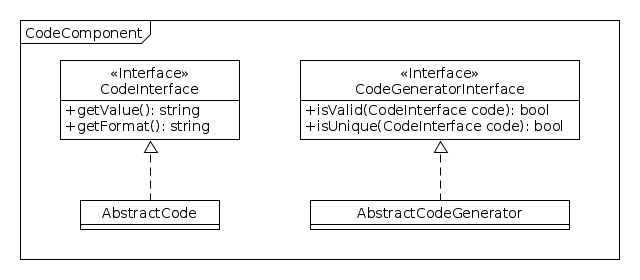

Codes
=====

Ce composant est un point de départ pour gérer des codes associés à des modèles métier.

-------
Modèles
-------

Code
----

Un **Code** (au sens codification d'éléments) est décrit à l'aide de 2 champs :

+-----------------+-------------------+
| Proriété        | Description       |
+=================+===================+
| format          | Le format du code |
+-----------------+-------------------+
| value           | La valeur du code |
+-----------------+-------------------+

Le format sera utilisé principalement pour la validation du code. Il peut, pour certains cas, être utilisé pour la génération à travers le générateur de code.

Générateur
-----------

Un **générateur** fournit des Codes valides. Il permet également de vérifier la validité de d'un code en se basant sur son format.

Il sera possible de réaliser des validations particulières en surchargeant la méthode ``validate`` du générateur en question.

Le générateur propose donc 2 méthodes :

+-----------------+-----------------------------------------------+
| Méthode         | Description                                   |
+=================+===============================================+
| validate        | Permet de valider que le code est bien valide |
+-----------------+-----------------------------------------------+
| generate        | Génère un nouveau code                        |
+-----------------+-----------------------------------------------+

La méthode ``generate`` n'est pas définie dans le composant car les règles de générations dépendent entièrement du métier sur lequel le code repose.
Il n'est donc pas possible de définir une interface universelle pour cette méthode dans le composant lui-même.
Il tiendra donc à chaque composant utilisant le composant code de définir lui-même sa propre interface pour le générateur de code associé à son (ou ses) modèle(s).

Modèle du domaine
=================

