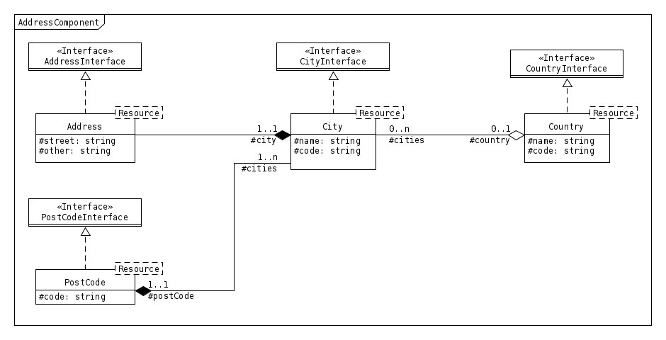

Adresses
========

Ce composant est un point central pour la gestion des adresses dans le SIL.

-------
Domaine
-------

Adresse
-------

Une **Adresse** se définit par les champs suivants :

+-----------------+-------------------------------------------------------+--------+
| Propriété       | Description                                           | Oblig. |
+=================+=======================================================+========+
| street          | Numéro et voie de l'adresse                           | x      |
+-----------------+-------------------------------------------------------+--------+
| city            | La ville                                              | x      |
+-----------------+-------------------------------------------------------+--------+
| other           | Un complément d'adresse, nécessaire pour certains cas |        |
+-----------------+-------------------------------------------------------+--------+

Ville
-----

Chaque **Ville** doit appartenir à un pays.

+-----------------+------------------------------------------------+--------+
| Propriété       | Description                                    | Oblig. |
+=================+================================================+========+
| name            | Le nom de la ville                             | x      |
+-----------------+------------------------------------------------+--------+
| postCode        | Un code postal                                 | x      |
+-----------------+------------------------------------------------+--------+
| country         | Un pays auquel appartient la ville             | x      |
+-----------------+------------------------------------------------+--------+
| code            | Un code (ex: code INSEE) représentant la ville |        |
+-----------------+------------------------------------------------+--------+

Code postal
-----------

Un **Code Postal** est un object comprenant un code sous forme de chaîne (pour permettre les codes commençants par 0xxxx) et de longueur non fixée pour permettre la gestion de codes postaux étrangers.

+-----------------+-----------------------------------------------------+--------+
| Propriété       | Description                                         | Oblig. |
+=================+=====================================================+========+
| code            | Le code postal représenté sous forme de chaine      | x      |
+-----------------+-----------------------------------------------------+--------+

Pays
----

Un **Pays** est définit par un nom et un code normalisé

+-----------------+----------------------------------------+--------+
| Propriété       | Description                            | Oblig. |
+=================+========================================+========+
| name            | Le nom du pays                         | x      |
+-----------------+----------------------------------------+--------+
| code            | Le code pays normalisé (voir ISO 3166) | x      |
+-----------------+----------------------------------------+--------+

Provinces
---------

Les provinces ne sont pas présentes dans ce composant étant donné que leur définition dépend entièrement des cas d'usages. Ce composant n'offre donc pas par défaut de gestion de région / département / autre groupement administratif.

-----------------
Modèle du domaine
-----------------

