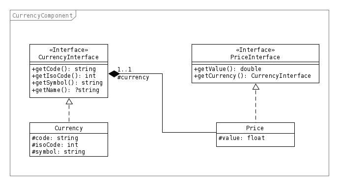

Currency
========

Ce composant est un point de départ pour gérer des monnaies et des prix

-------
Domaine
-------

Monnaie
-------

Une **Monnaie** (**Currency**) se définit par un **nom**, un **code** sous forme de chaîne de texte, un code numérique et un symbole la représantant.

+-----------------+---------------------------------------------------------------+
| Propriété       | Description                                                   |
+=================+===============================================================+
| name            | Le nom de la monnaie                                          |
+-----------------+---------------------------------------------------------------+
| code            | Le code texte ISO 4217 (code A) [1]_                          |
+-----------------+---------------------------------------------------------------+
| isoCode         | Un code numérique ISO 4217 (code N) [1]_                      |
+-----------------+---------------------------------------------------------------+
| symbol          | Le symbole représentant la monnaie (€, $, ...)                |
+-----------------+---------------------------------------------------------------+

.. [1] Conformément à la norme https://fr.wikipedia.org/wiki/ISO_4217, les codes alphabétiques et numériques sont présents dans le modèle.

Prix
----

Un **prix** (**Price**) est un objet définit par une **monnaie** et une **valeur**.

+-----------+---------------------------------------+
| Propriété | Description                           |
+===========+=======================================+
| currency  | La monnaie du prix courant            |
+-----------+---------------------------------------+
| value     | La valeur du prix (un nombre décimal) |
+-----------+---------------------------------------+

-----------------
Modèle du domaine
-----------------

