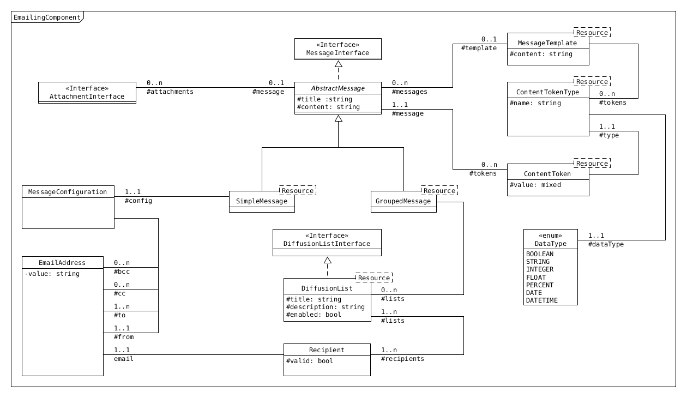

========
Emailing
========

----------------------
Description du domaine
----------------------

L'**emailing** consiste à **préparer** des envois d'emails en masse.

Cela consiste à créer une contenu textuel riche (HTML) et le diffuser à une liste de destinataires appelée **liste de diffusion**.

L'utilisation du mailing se fait principalement dans un cadre marketing, pour informer sa clientèle ou sa communauté, réaliser des prospections et démarchages, ou communiquer sur des actions commerciales promotionnelles.

Il peut également servir pour des envois ponctuels (sans passer par des listes de diffusions).

----------------------
Fonctionnalités cibles
----------------------

- `Gestion du contenu`_
- `Gestion des listes de diffusion`_
- `Paramétrage des envois`_
- `Gestion d'envoi simple`_
- `Gestion de modèles`_

Gestion du contenu
==================

Saisir le titre du message, son contenu (via éditeur de texte riche (éditeur WYSIWYG)), ses pièces jointes.

Il faut également gérer son cycle de vie. Selon son état, un mailing ne pourra être envoyé, modifié ou archivé.

Gestion des listes de diffusion
===============================

Le composant doit pouvoir proposer une gestion de liste de diffusion. une liste de diffusion est nommée et est composée d'un ou plusieurs destinataires.

Paramétrage des envois
======================

Pour chaque message simple, il doit être possible de paramétrer des informations liées à l'envoi : expéditeur, répondre à, copie.

Gestion d'envoi simple
======================

Pouvoir gérer des envois de mail simples : A destination d'une seul contact. Il faut également conserver l'historique des envois par contacts.

Gestion de modèles
==================

Une gestion de modèle de contenu doit permettre la création rapide de campagne d'emailing. Il faudra également prévoir un système de remplacement de jeton [1]_ pour permettre de pré-remplir certaines informations.

.. [1] Un jeton est un emplacement dans un contenu texte qui sera substitué par une valeur lors de la construction du contenu

-------
Domaine
-------

Message groupé
==============

Un **message groupé** est définit de cette manière :

+-------------+---------------------------------------------------------+--------+
| Propriété   | Description                                             | Oblig. |
+=============+=========================================================+========+
| title       | Le titre du message. Sera également l'objet de l'email. | x      |
+-------------+---------------------------------------------------------+--------+
| content     | Le contenu du message.                                  |        |
+-------------+---------------------------------------------------------+--------+
| attachments | Les pièces jointes du message.                          |        |
+-------------+---------------------------------------------------------+--------+
| lists       | Les listes de diffusion qui seront utilisées.           |        |
+-------------+---------------------------------------------------------+--------+

Message simple
==============

Un **message simple** est définit de cette manière :

+-------------+---------------------------------------------------------+--------+
| Propriété   | Description                                             | Oblig. |
+=============+=========================================================+========+
| title       | Le titre du message. Sera également l'objet de l'email. | x      |
+-------------+---------------------------------------------------------+--------+
| content     | Le contenu du message.                                  |        |
+-------------+---------------------------------------------------------+--------+
| attachments | Les pièces jointes du message.                          |        |
+-------------+---------------------------------------------------------+--------+
| config      | La configuration d'expédition du message.               |        |
+-------------+---------------------------------------------------------+--------+

Configuration de message
========================

Une **configuration de message** gère les paramètres suivants :

+-----------+-----------------------------------------------+
| Propriété | Description                                   |
+===========+===============================================+
| from      | L'expéditeur qui sera définit pour le message |
+-----------+-----------------------------------------------+
| to        | Le destinataire du message [2]_               |
+-----------+-----------------------------------------------+
| cc        | Une adresse email qui sera mise en copie [2]_ |
+-----------+-----------------------------------------------+
| bcc       | Une adresse email en copie cachée [2]_        |
+-----------+-----------------------------------------------+

.. [2] Ce paramètre du message sera utilisé que lors d'envoi de message simple (hors listes de diffusion)

Liste de diffusion
==================

Une **liste de diffusion** se définit par un titre et une collection de **destinataires**.

+-------------+--------------------------------+--------+
| Propriété   | Description                    | Oblig. |
+=============+================================+========+
| title       | Le titre de la liste           | x      |
+-------------+--------------------------------+--------+
| description | Une description optionnelle    |        |
+-------------+--------------------------------+--------+
| enabled     | La list est utilisable ou non  |        |
+-------------+--------------------------------+--------+
| recipients  | Une collection de destinataire |        |
+-------------+--------------------------------+--------+

Destinataire
============

Un **destinataire** est une représentation d'une adresse email.

+-----------+----------------------------------------------------+--------+
| Propriété | Description                                        | Oblig. |
+===========+====================================================+========+
| email     | L'adresse email du destinataire                    | x      |
+-----------+----------------------------------------------------+--------+
| valid     | Un indicateur d'état de validité de l'adresse [3]_ |        |
+-----------+----------------------------------------------------+--------+

.. [3] Cet indicateur sera à mettre à jour en fonction des retours après envoi. (voir https://en.wikipedia.org/wiki/Bounce_message)

Pièce jointe
============

Une pièce jointe représentera un fichier à joindre au message.

Modèle de message
=================

Un **modèle de message** permet de définir une mise en page de base pour les messages ainsi que la définition de jetons de substitution pour faciliter la saisie des messages utilisant un modèle.

+-----------+-----------------------------------------------+--------+
| Propriété | Description                                   | Oblig. |
+===========+===============================================+========+
| content   | Contenu du modèle                             |        |
+-----------+-----------------------------------------------+--------+
| tokens    | Collection de types de jetons de substitution |        |
+-----------+-----------------------------------------------+--------+

Type de jeton de substitution
=============================

Un **type de jeton** permet de définir quelle donnée sera affichée dans un modèle de message.

+-----------+-----------------------+--------+
| Propriété | Description           | Oblig. |
+===========+=======================+========+
| name      | Nom du type de donnée |        |
+-----------+-----------------------+--------+
| dataType  | Type de donnée cible  |        |
+-----------+-----------------------+--------+

Jeton de substitution
=====================

Un **jeton de substitution** permet de remplacer des emplacements définis depuis un modèle par des valeurs de substitution.

+-----------+---------------------------------+--------+
| Propriété | Description                     | Oblig. |
+===========+=================================+========+
| value     | Valeur du jeton de substitution |        |
+-----------+---------------------------------+--------+
| type      | Type de jeton                   | x      |
+-----------+---------------------------------+--------+

-----------------
Modèle du domaine
-----------------

