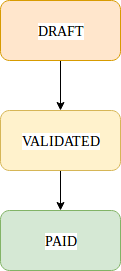

Invoice
-------

Les factures sont représentées par le modèle Invoice.

La propriété ``createdAt`` prendra sa valeur lors du changemenent du statut de la facture à "validé".
La propriété ``status`` à pour valeur un objet ``InvoiceStatus``.
La propriété ``customer`` à pour valeur un objet ``CustomerInfo``.

+-----------------+-----------------------------------------------------------------------------+
| Propriété       | Description                                                                 |
+=================+=============================================================================+
| code            | Code de la facture                                                          |
+-----------------+-----------------------------------------------------------------------------+
| date            | Date de livraison, fin d'exécution                                          |
+-----------------+-----------------------------------------------------------------------------+
| taxRate         | Taux des taxes appliquées                                                   |
+-----------------+-----------------------------------------------------------------------------+
| taxesAmount     | Montant des taxes appliquées                                                |
+-----------------+-----------------------------------------------------------------------------+
| currency        | Devise des montants                                                         |
+-----------------+-----------------------------------------------------------------------------+
| sellerInfo      | Information sur le vendeur (raison sociale, SIRET, ...)                     |
+-----------------+-----------------------------------------------------------------------------+
| customer        | Informations sur le client                                                  |
+-----------------+-----------------------------------------------------------------------------+
| dueDate         | Date d'échéance                                                             |
+-----------------+-----------------------------------------------------------------------------+
| subTotal        | Total hors taxes                                                            |
+-----------------+-----------------------------------------------------------------------------+
| grandTotal      | Total TTC                                                                   |
+-----------------+-----------------------------------------------------------------------------+
| paidAmount      | Montant réglé                                                               |
+-----------------+-----------------------------------------------------------------------------+
| dueAmount       | Montant dû                                                                  |
+-----------------+-----------------------------------------------------------------------------+
| createdAt       | Date d'émission                                                             |
+-----------------+-----------------------------------------------------------------------------+
| paymentTerms    | Conditions de paiement                                                      |
+-----------------+-----------------------------------------------------------------------------+
| items           | Collection des produits ou services facturés                                |
+-----------------+-----------------------------------------------------------------------------+
| adjustments     | Collection des ajustements au montant de la facture                         |
+-----------------+-----------------------------------------------------------------------------+

Cycle de vie d'une facture
--------------------------

A la création, la facure sera en état ``draft`` (brouillon).
Elle sera donc validée (état ``validated``), ce qui correspond à l'émission de la facture.
Une fois la facture soldée elle passera à l'état ``paid`` et le statut ne pourra plus évoluer.

