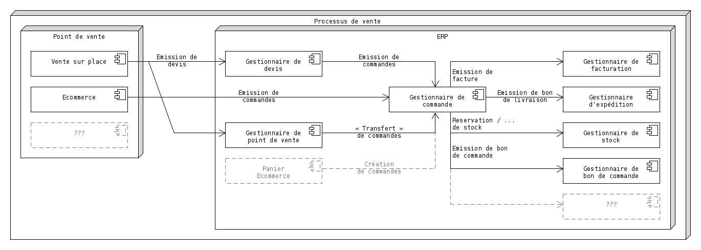
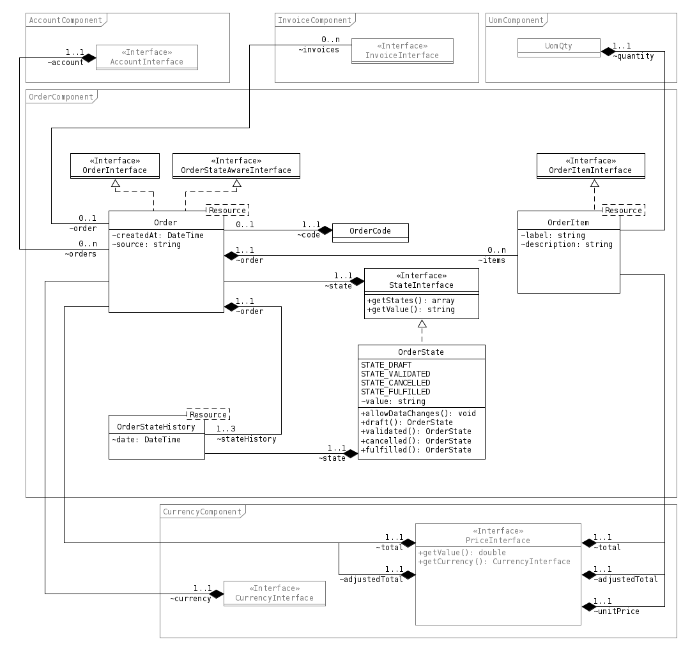
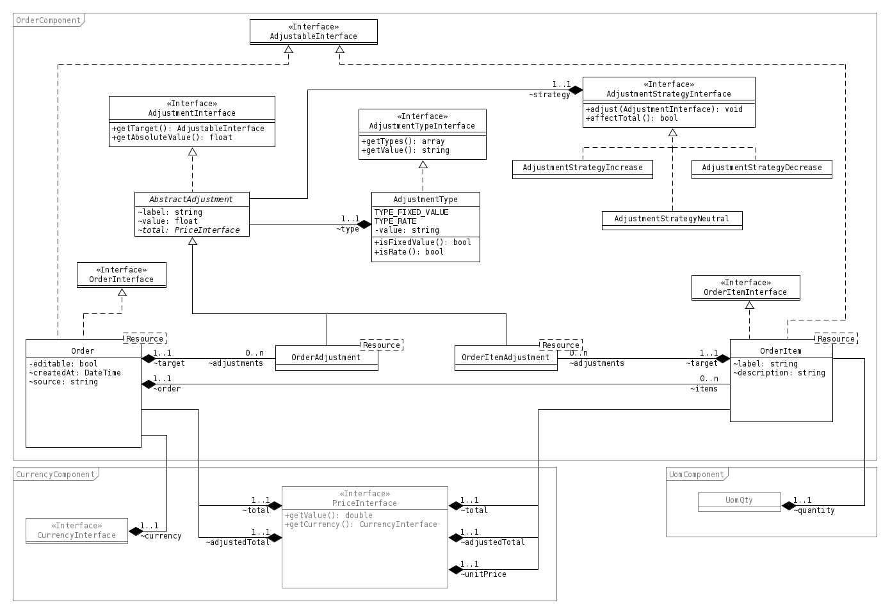
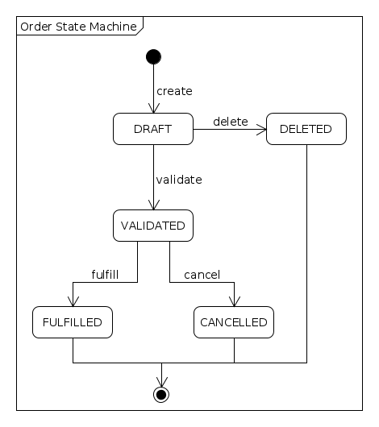

========
Commande
========

Description du domaine
======================

Une commande doit pouvoir refléter des passages de commandes de clients à destination de l'entreprise.

Une commande intervient après qu'un client ait validé et transmis ses besoins (devis, panier) et avant qu'une facturation soit initiée.

Une commande ne joue pas le rôle de **bon de commande** ou **bon de livraison**.

Ces commandes doivent être saisissables manuellement, peu importe la source qui à réalisée la commande (e-commerce, vente sur place).

Il est également possible de saisir ces commandes de façon automatique (via API).

Il n'y a pas de cadre légal définissant les notions de commandes, leur représentation est donc libre selon les cas d'utilisation.

Processus général de vente
==========================

--------
Commande
--------

Une commande est définissable à l'aide de :

+-----------------+---------------------------------------------------+
| Propriété       | Description                                       |
+=================+===================================================+
| code            | Code unique de la commande                        |
+-----------------+---------------------------------------------------+
| state           | État reflétant le cycle de vie de la commande     |
+-----------------+---------------------------------------------------+
| items           | Collection des éléments d'une commande            |
+-----------------+---------------------------------------------------+
| total           | Prix total de la commande                         |
+-----------------+---------------------------------------------------+
| creationDate    | Date de création de la commande                   |
+-----------------+---------------------------------------------------+
| stateHistory    | Historique des changements d'états de la commande |
+-----------------+---------------------------------------------------+
| invoices        | Collection des factures associées [1]_            |
+-----------------+---------------------------------------------------+
| account         | Le compte client associé à la commande [2]_       |
+-----------------+---------------------------------------------------+
| source          | Indique la provenance de la commande              |
+-----------------+---------------------------------------------------+

.. [1] Les factures pouvant être générées sans forcément avoir une commande, il est donc normal d'avoir des commandes en état ``FULFILLED`` sans aucune facture.
.. [2] Un compte est obligatoire pour pouvoir créer une commande.

-------------------
Élément de commande
-------------------

Un élément de commande est définissable par :

+-----------------+----------------------------------------+
| Propriété       | Description                            |
+=================+========================================+
| label           | Libellé de l'élément de commande       |
+-----------------+----------------------------------------+
| description     | Description courte décrivant l'élément |
+-----------------+----------------------------------------+
| quantity        | La quantité représenté par l'élément   |
+-----------------+----------------------------------------+
| unitPrice       | Le prix unitaire de l'élément          |
+-----------------+----------------------------------------+

-----------------
Modèle du domaine
-----------------

Version simplifiée
------------------

Version avec ajustements
------------------------

Cycle de vie
============

Une commande peut passer par plusieurs états tout au long de son cycle de vie. Elle ne peut avoir qu'un seul état à la fois.

Le cycle de vie est volontairement simpliste afin de proposer une gestion basique de commande. Chaque solution métier devra redéfinir plus en détails ce cycle de vie pour correspondre d'avantage aux spécificités du métier.

-----
États
-----

- ``DRAFT`` : Brouillon

Une commande en état brouillon peut être supprimée ou validée.

- ``VALIDATED`` : Validée

Une fois validée, une commande ne pourra jamais être supprimée ou revenir à l'état de brouillon.

- ``CANCELLED`` : Annulée

Une commande annulée à atteint la fin de son cycle de vie. Aucune nouvelle action ne peut y être appliquée. Seule une commande validée peut être annulée.

- ``FULFILLED`` : Traitée

Une commande traitée à atteint la fin de son cycle de vie. Aucune nouvelle action ne peut y être appliquée. Seule une commande validée peut être traitée.

- ``DELETED`` : Supprimée

Une commande supprimée à atteint la fin de son cycle de vie. Aucune nouvelle action ne peut y être appliquée. Seule une commande brouillon peut être supprimée.

-----------
Transitions
-----------

--------------
Machine à état
--------------

La machine à état est embarquée dans l'état lui-même. Cela permet de maîtriser les changements d'état au sein même du modèle de donnée.

Les transitions implémentées sont les suivantes :

+-----------------+----------------------------------------+----------------------------------------+
| Transition      | États                                  | Description                            |
+=================+========================================+========================================+
| delete          | de DRAFT                               | Marque la commande comme « supprimée » |
|                 +----------------------------------------+                                        |
|                 | à DELETED                              |                                        |
+-----------------+----------------------------------------+----------------------------------------+
| validate        | de DRAFT                               | Valide la commande brouillon pour être |
|                 +----------------------------------------+ traitée                                |
|                 | à VALIDATED                            |                                        |
+-----------------+----------------------------------------+----------------------------------------+
| fulfill         | de VALIDATED                           | La commande à été traitée et peut être |
|                 +----------------------------------------+ considérée comme close                 |
|                 | à FULFILLED                            |                                        |
+-----------------+----------------------------------------+----------------------------------------+
| cancel          | de VALIDATED                           | La commande est annulée mais ne peut   |
|                 +----------------------------------------+ être supprimée                         |
|                 | à CANCELLED                            |                                        |
+-----------------+----------------------------------------+----------------------------------------+

La transition **create** n'est pas gérée par la machine à états car cette transition est implicitement faite lors de l'instanciation d'un objet **Order**.
