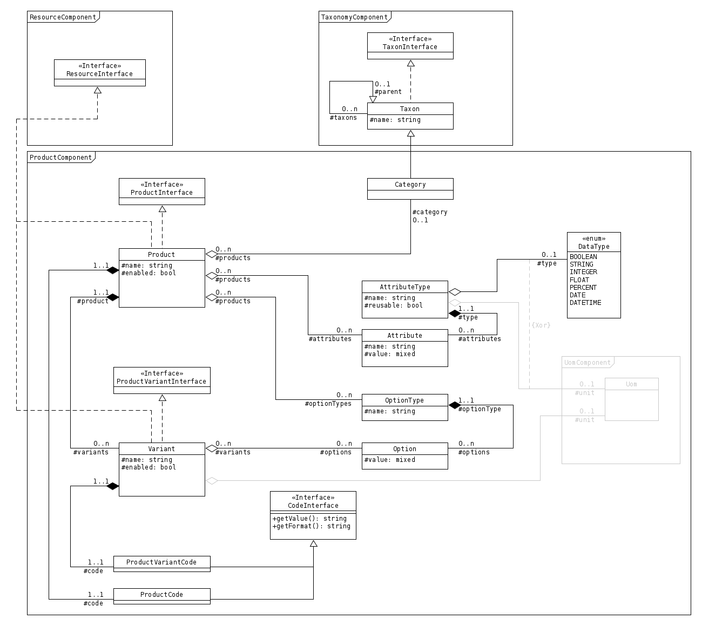

Produits
========

Ce composant est un point de départ pour gérer des manipulations de produit avec des options basiques

-------
Domaine
-------

Produit
-------

Un **Produit** se définit par un **nom** et un champ unique **code**. Un **Produit** n'est pas un produit réel, c'est un produit virtuel.

+-----------------+---------------------------------------------------------------+--------+
| Propriété       | Description                                                   | Oblig. |
+=================+===============================================================+========+
| name            | Le nom du produit                                             | x      |
+-----------------+---------------------------------------------------------------+--------+
| description     | Une description du produit                                    |        |
+-----------------+---------------------------------------------------------------+--------+
| code            | Un code unique                                                | x      |
+-----------------+---------------------------------------------------------------+--------+
| enabled         | Le produit est actif ou non (oui par défaut)                  |        |
+-----------------+---------------------------------------------------------------+--------+
| attributes      | Une collection d'attributs décrivant le produit               |        |
+-----------------+---------------------------------------------------------------+--------+
| optionTypes     | Une collection des types d'option disponibles pour le produit |        |
+-----------------+---------------------------------------------------------------+--------+
| variants        | Une collection de déclinaisons de produit                     |        |
+-----------------+---------------------------------------------------------------+--------+

Déclinaison
-----------

Chaque **Produit** peut avoir une ou plusieurs variantes

+-----------------+---------------------------------------------------------------------+--------+
| Propriété       | Description                                                         | Oblig. |
+=================+=====================================================================+========+
| name            | Le nom de la déclinaison du produit                                 | x      |
+-----------------+---------------------------------------------------------------------+--------+
| code            | Un code unique composé du code du produit + celui de la déclinaison | x      |
+-----------------+---------------------------------------------------------------------+--------+
| enabled         | La déclinaison est active ou non (oui par défaut)                   |        |
+-----------------+---------------------------------------------------------------------+--------+
| product         | Le produit associé                                                  | x      |
+-----------------+---------------------------------------------------------------------+--------+

Attribut
--------

Un **Attribut** est un object permettant de décrire une propriété physique (ou virtuelle) d'un produit. Il peut être utilisé pour créer des filtres qui se basent sur ces attributes de produits

Un **Produit** possède ses propres collections d'attributs, mais dans certains cas, des attributs peuvent être partagés entre les produits (voir la propriété **reusable** de l'objet **AttributeType**)

+-----------------+----------------------------------------------------------------------------------+--------+
| Propriété       | Description                                                                      | Oblig. |
+=================+==================================================================================+========+
| name            | Le nom surchargé de l'attribut (si null, le nom du type d'attribut sera utilisé) |        |
+-----------------+----------------------------------------------------------------------------------+--------+
| value           | La valeur courante de l'attribut                                                 | x      |
+-----------------+----------------------------------------------------------------------------------+--------+
| attributeType   | Le type d'attribut                                                               | x      |
+-----------------+----------------------------------------------------------------------------------+--------+
| products        | Une collection de produit qui utilisent l'attribut                               |        |
+-----------------+----------------------------------------------------------------------------------+--------+

Type d'attribut
---------------

Un **Type d'attribut** est une famille d'attributs. Il possède un type de donnée aidant à l'affichage et à la manipulation des données des attributs enfants.

Certains attributs peuvent être marqués comme étant **réutilisables** dans le but de partager les attributs entre produits.

+-----------------+-----------------------------------------------------------+--------+
| Propriété       | Description                                               | Oblig. |
+=================+===========================================================+========+
| name            | Le nom du type d'attribut                                 | x      |
+-----------------+-----------------------------------------------------------+--------+
| type            | Le type de donnée                                         |        |
+-----------------+-----------------------------------------------------------+--------+
| resusable       | Définit si les attributs seront partagés [1]_             |        |
+-----------------+-----------------------------------------------------------+--------+
| attributes      | Une collection d'attributs appartenant au type d'attribut |        |
+-----------------+-----------------------------------------------------------+--------+

.. [1] Une type d'attribut **reusable** (à savoir réutilisable) partagera ses attributs entre tous les produits les utilisant.
 Il faudra donc empêcher la modification des attributs depuis un produit.

Option
------

Une **Option** est liée à une déclinaison de produit

+-----------------+------------------------------------------------------+--------+
| Propriété       | Description                                          | Oblig. |
+=================+======================================================+========+
| value           | La valeur de l'option                                | x      |
+-----------------+------------------------------------------------------+--------+
| optionType      | Le type d'option                                     | x      |
+-----------------+------------------------------------------------------+--------+
| variants        | Une collection de déclinaison utilisant cette option |        |
+-----------------+------------------------------------------------------+--------+

Type d'option
-------------

Un **Type d'option** est lié à un produit et permet de définir quel type d'option sera à utiliser par les déclinaisons.

+-----------------+--------------------------------------------------------+--------+
| Propriété       | Description                                            | Oblig. |
+=================+========================================================+========+
| name            | Le nom du type d'option                                | x      |
+-----------------+--------------------------------------------------------+--------+
| options         | Une collection d'option appartenant à ce type d'option |        |
+-----------------+--------------------------------------------------------+--------+
| products        | Une collection de produit ayant ce type d'option       |        |
+-----------------+--------------------------------------------------------+--------+

-----------------
Modèle du domaine
-----------------

